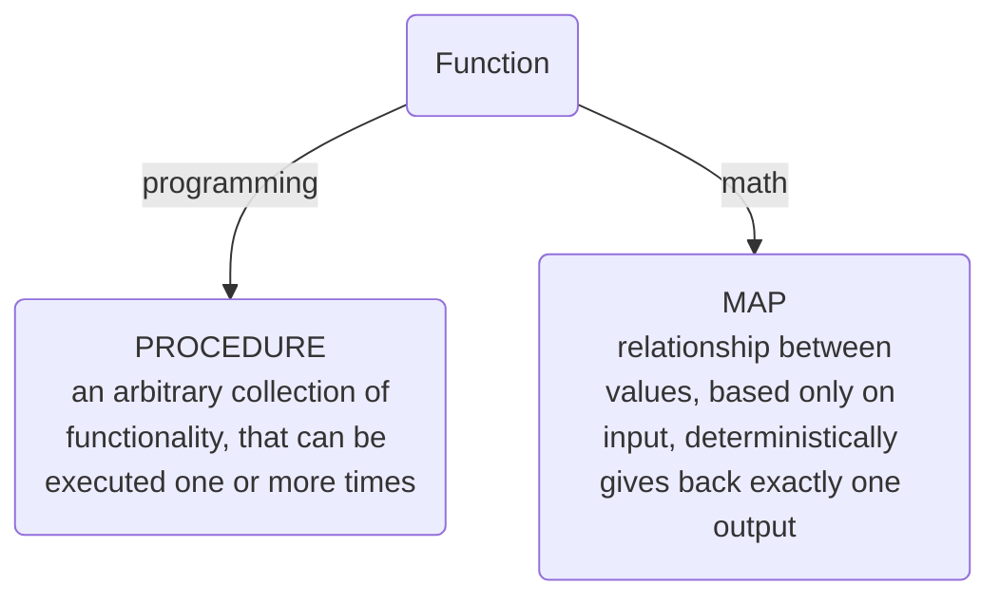
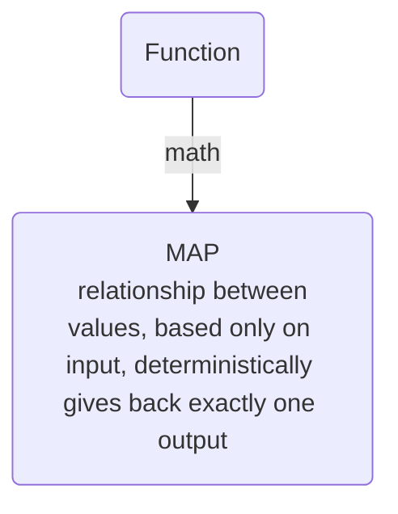

# Basic concepts

---
layout: section
---

<v-clicks>

**Functional programming** - programming with functions



</v-clicks>

---
layout: section
---


**Functional programming** - programming with functions



Usually we call these "pure functions".

---

### Implications of this definition:

<v-clicks>

- pure (no observable side effects)
- easy to parallelize (no shared state)
- idempotent & cacheable (you can memorize the previous outputs)
- testable (forget about mocks or assertions of shared state)
- reliable, easier to debug (referential transparency)
- reusable, composable, portable

</v-clicks>
<v-click>
<div class="text-center">
  <div class="mt-5 mb-3">
  
  ### Side Effects = "he who must not be named"
  </div>
  
</div>
</v-click>

<!--
Side effects:
- changing the file system
- inserting a record into a database
- making an http call
- mutations
- printing to the screen / logging
- obtaining user input
- querying the DOM
- accessing shared system state
-->

---
layout: section
---

## Let's play - pure function or not a pure function?


---

<div class="grid gap-4 grid-cols-2">
<v-click>
<div>

```python
def increment(a):
  return a + 1
```
</div>
</v-click>

<v-click>
<div>

```python
def birthday(user):
  user.age += 1
  return user
```
</div>
</v-click>

<v-click>
<div>

```python
def shout(sentence):
  return sentence.upper() + '!'
```
</div>
</v-click>

<v-click>
<div>

```python
def parseQueryString(query):
  return [x.split('=') for x in query[1:].split('&')]
```
</div>
</v-click>

<v-click>
<div>

```python
def signUp(input):
  user = dbProvider.save(input)
  emailProvider.sendWelcomeEmail(user)
```
</div>
</v-click>

<v-click>
<div>

```python
def getLastElement(arr):
  return arr.pop()
```
</div>
</v-click>

<v-click>
<div>

```python
def getLastElement2(arr):
  return arr[-1]
```
</div>
</v-click>

<v-click>
<div>

```python
def add(a, b):
  print(f'Adding {a} + {b}')
  return a + b
```
</div>
</v-click>

</div>

